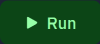

# README

A `linked list` is a sequence container that supports constant time insertion and removal of elements from anywhere in the container. Fast random access is not supported. The storage of the list is handled automatically, being expanded and contracted as needed.

## run
press `Ctrl` `Enter` or click  to build and run correctness tests.

## make
```sh
# make default (same as make build)
make

# to build only (do not run, default)
make build

# to build and test correctness:
make test

# to build and test coverage
make coverage

# to build and check for memory errors
make memoryerrortest

# to clean up (remove executable, coverage files)
make clean
```

## files

* `main.cpp`: unit tests and main()
* `assets/run.png`: image of the Run button
* `.gitignore`: defines files for Git to ignore
* `.replit`: defines operation of Run button
* `Makefile`: build instructions for make
* `readme.md`: this file
* `todo.md`: todo list 
* `linked_list.hpp`: declaration of linked_list class and methods